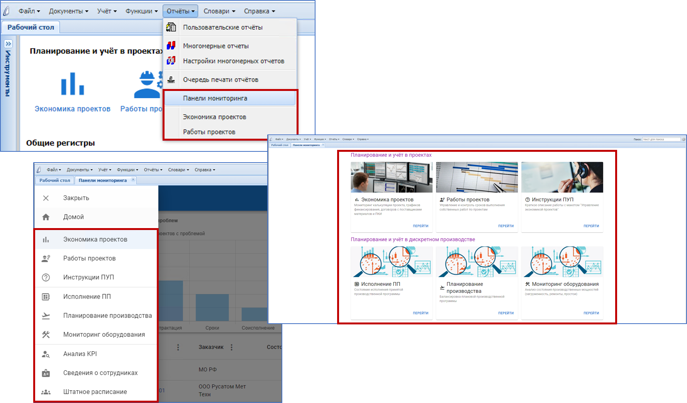
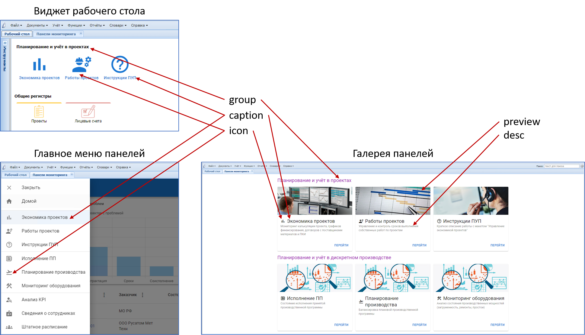
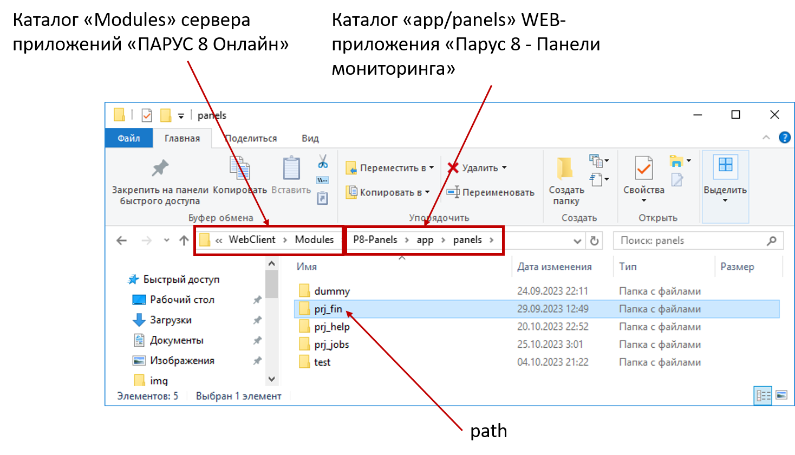

# P8-Panels

# "Панели" расширение к "ПАРУС 8 Онлайн"

## Термины и сокращения

**Система** - "ПАРУС 8 Предприятие"\
**БД** - База Данных\
**СУБД** - Система Управления Базами Данных\
**Расширение** - программный комплекс, дополняющий функциональность той или иной программной системы. В контексте данного документа (если не указано иное) - описываемое расширение "Панели".\
**Фреймворк** - программная платформа, определяющая структуру программной системы, программное обеспечение, облегчающее разработку и объединение разных компонентов большого программного проекта. В контексте данного документа (если не указано иное) - описываемое расширение "Панели".\
**Панель** - представление данных и функций Системы, реализованное с применением описываемого фреймворка\
**SPA** - Single Page Application - технология разработки WEB-приложений, предполагающая динамическую генерацию интерфейса внутри одного HTML-документа, отображаемого браузером\
**HTML** - HyperText Markup Language — язык гипертекстовой разметки\
**CSS** - Cascading Style Sheets - каскадные таблицы стилей\
**DOM** - Document Object Model - объектная модель документа (в контексте данного документа - HTML)\
**JS** - JavaScript — мультипарадигменный интерпретируемый язык программирования\
**JSX** - JavaScript eXtension - расширение JavaScript, которое позволяет создавать деревья DOM с использованием синтаксиса, подобного XML

## I. Назначение

Расширение представляет собой фреймворк, основной задачей которого является сокращение времени разработки нестандартных графических интерфейсов и панелей мониторинга, работающих в составе WEB-приложения "ПАРУС 8 Онлайн".

## II. Состав

В расширение входят:

-   Библиотека расширения "P8-Panels-ParusOnlineExt.dll" для сервера приложений "ПАРУС 8 Онлайн" - обеспечивает низкоуровневое взаимодействие разрабатываемых панелей с Системой
-   Хранимые объекты сервера БД Системы, обеспечивающие обмен данными между панелями и учётными регистрами Системы
-   API для высокоуровневого взаимодействия с сервером БД Системы
-   API для взаимодействия разрабатываемых панелей с WEB-приложением "ПАРУС 8 Онлайн"
-   WEB-приложение "Парус 8 - Панели мониторинга", являющееся "точкой входа" для подключения реализуемых панелей, включающее в себя:
    -   Подключенные и настроенные библиотеки ["React"](https://react.dev/), ["React-Router"](https://reactrouter.com/), ["MUI"](https://mui.com/)
    -   Настроенный транспайлер ["Babel"](https://babeljs.io/)
    -   Настроенный сборщик WEB-приложений ["WebPack"](https://webpack.js.org/)
    -   Настроенный статический анализатор кода ["ESLint"]()
    -   Настройки среды разработки ["Visual Studio Code"](https://code.visualstudio.com/)
    -   Готовый контекст React-приложения
    -   Компоненты для отображения единого бокового меню подключенных панелей, галереи подключенных панелей, интеграции в рабочий стол WEB-приложения "ПАРУС 8 Онлайн"
    -   Готовые панели мониторинга для ряда прикланых приложений Системы

## III. Требования к разработчику

Для успешной разработки собственных панелей, с применением описываемого фреймворка потребуются знания следующих технологий:

-   HTML, CSS, JS, JSX
-   Разработка SPA WEB-приложений
-   Знакомство с основами работы перечисленных выше библиотек и системных средств (в первую очередь "React")
-   Знание архитектуры Системы, принципов работы и организации её серверной части

На видеохостинге YouTube можно ознакомиться с уроками и обучающими курсами по большинству из перечисленных технологий. Например, с [этими](https://www.youtube.com/results?search_query=%D0%BF%D0%BE%D0%BB%D0%BD%D1%8B%D0%B9+%D0%BA%D1%83%D1%80%D1%81+react).

## IV. Установка

1. Установите сервер приложений "ПАРУС 8 Онлайн" согласно документации (см. "Парус-Онлайн 2. Часть 1. Установка ГГГГ.ММ.docx").
2. Разместите на диске сервера приложений библиотеку расширения "P8-Panels-ParusOnlineExt", для этого скопируйте содержимое папки "bin" из [репозитория расширения "P8-Panels-ParusOnlineExt"](https://github.com/CITKParus/P8-Panels-ParusOnlineExt), например, в каталог "C:\p8web20\Ext\P8-Panels-ParusOnlineExt".
3. Подключите библиотеку расширения к серверу приложений "ПАРУС 8 Онлайн". Для этого добавьте ссылку на библиотеку в файл "Config\extensions.config" сервера приложений:

```
<?xml version="1.0"?>
<parus.extensions enabled="true" resolveKind="Static" viewsMode="Shared" rootPath="c:\p8web20\Ext\">
	<extensions>
		<extension assembly="P8PanelsParusOnlineExt" path="P8-Panels-ParusOnlineExt\bin\P8-Panels-ParusOnlineExt.dll"/>
	</extensions>
</parus.extensions>
```

Где:

-   `rootPath="c:\p8web20\Ext\"` - атрибут, указывающий на корневой каталог хранения расширений для сервера приложений "ПАРУС 8 Онлайн"
-   `path="P8-Panels-ParusOnlineExt\bin\P8-Panels-ParusOnlineExt.dll"` - атрибут, указывающий на каталог размещения библиотеки расширения "Панели" относительного коревого `rootPath`

4. Установите в файле конфигурации "PrecompiledApp.config" сервера приложений атрибут `updatable` в `true`:

```
<precompiledApp version="2" updatable="true"/>
```

5. Разместите WEB-приложение "Парус 8 - Панели мониторинга" на сервере приложений "ПАРУС 8 Онлайн". Для этого в каталоге "Modules" сервера приложений создайте подкаталог "P8-Panels" и проведите клонирование репозитория ["P8-Panels"](https://github.com/CITKParus/P8-Panels) в него:

```
git clone https://github.com/CITKParus/P8-Panels.git
```

6. Проведите компиляцию хранимых объектов БД из каталога "db" клонированного репозитория (компиляцию проводить под пользователем-владельцем схемы серверной части Системы, с последующей перекомпиляцией зависимых инвалидных объектов), затем исполните скрипт "grants.sql", размещённый в этом же каталоге.

7. Перезапустите сервер приложений "ПАРУС 8 Онлайн"

## V. Подключение поставляемых панелей мониторинга

В корневом каталоге репозитория ["P8-Panels"](https://github.com/CITKParus/P8-Panels) расположен файл "p8panels.config", содержащий конфигурацию поставляемых с расширением типовых панелей.

Данный файл определяет какие панели подключены к WEB-приложению, порядок формирования пунктов главного меню "ПАРУС 8 Онлайн" для доступа к подключенным панелям, состав галереи панелей и бокового меню навигации WEB-приложения "Парус 8 - Панели мониторинга", работающего в контексте "ПАРУС 8 Онлайн".



Данный файл конфигурации необходимо разместить локально, в папке "Config" сервера приложений "ПАРУС 8 Онлайн".
Например, если сервер приложений установлен в "c:\p8web20\WebClient", то путь к "p8panels.config" должен быть "c:\p8web20\WebClient\Config\p8panels.config".

Рассмотрим формат файла конфигурации панелей на примере. Ниже приведён фрагмет "p8panels.config" из поставки расширения.

```
<CITK.P8Panels>
    <MenuItems>
	    <App name="ProjectPlanning">
            <MenuItem parent="{BA073333-DFBC-4BA3-8EA7-172F3F6B4FEE}" separator="true"/>
            <MenuItem parent="{BA073333-DFBC-4BA3-8EA7-172F3F6B4FEE}" name="ShowPrjPanelsRoot" caption="Панели мониторинга" url="Modules/p8-panels/"/>
            <MenuItem parent="{BA073333-DFBC-4BA3-8EA7-172F3F6B4FEE}" separator="true"/>
            <MenuItem parent="{BA073333-DFBC-4BA3-8EA7-172F3F6B4FEE}" name="ShowPrjPanelFin" caption="Экономика проектов" panelName="PrjFin"/>
            ...
        </App>
    </MenuItems>
    <Panels urlBase="Modules/p8-panels/#/">
        <Panel
                name="PrjFin"
                group="Планирование и учёт в проектах"
                caption="Экономика проектов"
                desc="Мониторинг калькуляции проекта, графиков финансирования, договоров с поставщиками материалов и ПКИ"
                url="prj_fin"
                path="prj_fin"
                icon="bar_chart"
                showInPanelsList="true"
                preview="./img/prj_fin.png"/>
        ...
    </Panels>
</CITK.P8Panels>
```

Настройки хранятся в формате XML. Корневым тэгом документа должен быть `CITK.P8Panels`. Дочерними для него могут быть две ветки конфигурации:

-   `MenuItems` - настройка пунктов главного меню WEB-приложения "ПАРУС 8 Online"
-   `Panels` - общий список панелей, подключаемых к приложению (не все панели обязательно выводить в виде пунктов меню)

`MenuItems` состоит из элементов `App`, каждый из которых определяет для какого из приложений Системы описываются пункты меню. `MenuItems` может содержать несколько элементов `App`. Каждый элемент `App` должен иметь обязательный атрибут `name`, определяющий код приложения Системы (см. колонку `APPCODE` в таблице `APPLIST`), в которое будут добавлены пункты меню. Дочерними для элемента `App` являются элементы `MenuItem`, каждый из которых описывает создаваемый расширением пункт меню. `App` может содержать несколько `MenuItem`. Каждый из `MenuItem` может иметь следующие атрибуты:

-   `parent` - обязательный, содержит GUID родительского пункта меню, к которому будет добавлен описываемый дочерний пункт (см. `P_MENUS_CREATE_*_MENU`, где `*` - код приложения Системы)
-   `separator` - необязательный, принимает значения "true" или "false", если "true" - создаваемый пункт меню будет разделителем, остальные атрибуты, описанные ниже будут проигнорированы
-   `name` - необязательный для `separator="true"`, в прочих случаях - обязательный, уникальное имя пункта меню
-   `caption` - необязательный для `separator="true"`, в прочих случаях - обязательный, видимый текст пункта меню
-   `panelName` - необязательный для `separator="true"` или если указан атрибут `url`, в прочих случаях - обязательный, определяет код панели, открываемой при выборе данного пункта меню конечным пользователем (коды панелей объявляются в секции `Panels` данного файла конфигурации, описана ниже)
-   `url` - необязательный для `separator="true"` или если указан атрибут `panelName`, в прочих случаях - обязательный, определяет URL, который будет открыт в отдельной закладке "ПАРУС 8 Онлайн" при выборе данного пункта меню конечным пользователем (в приведённом примере, для пункта меню "ShowPrjPanelsRoot" открывает домашнюю страницу WEB-приложения "Парус 8 - Панели мониторинга", отображающую галерею доступных панелей, см. ниже описание атрибута `urlBase` элемента `Panels`)

`Panels` - содержит список элементов `Panel`, описывающих подключенные панели. Элемент `Panels` имеет атрибут `urlBase`, определяющий корневой URL WEB-приложения "Парус 8 - Панели мониторинга", относительно него формируются URL панелей. Значение `urlBase` определяется физическим расположением WEB-приложения "Парус 8 - Панели мониторинга" на диске сервера приложений (см. пункт 5 в главе "IV. Установка"). В данном примеры, файлы WEB-приложения распологаются в каталоге "Modules/p8-panels" сервера приложений. Каждый из элементов `Panel`, дочерних для `Panels`, описывает одну панель и имеет следующие атрибуты:

-   `name` - обязательный, строка, указывается латиницей, определяет уникальное имя панели
-   `group` - необязательный, строка, указывается кириллицей, определяет имя группы, в которую входит панель (применяется при формировании галереи панелей, главного меню панелей и ссылок на рабочем столе)
-   `caption` - обязательный, строка, видимое наименование панели (применяется в галереи панелей, главном меню панелей, ссылках на рабочем столе, заголовках закладок)
-   `desc` - необязательный, строка,
-   `url` - обязательный, строка, указывается латиницей, относительй URL панели (по адресу `Panel.urlBase` + `Panel.Panels.url` сервер приложений "ПАРУС 8 Онлайн" будет выдавать HTML-страницу панели), для простоты навигации может повторять значение атрибута `path`
-   `path` - обязательный, строка, путь к исходному коду панели в структуре каталогов WEB-приложения "Парус 8 - Панели мониторинга" (панели должны размещаться в "app/panels", в данном атрибуте указыватся только имя каталога, созданного для панели в "app/panels")
-   `icon` - обязательный, строка, код иконки панели из символов шрифта [Google Material Icons](https://fonts.google.com/icons?icon.set=Material+Icons) (применяется при формировании галереи панелей, главного меню панелей и ссылок на рабочем столе)
-   `showInPanelsList` - обязательный, принимает значения "true" или "false", определяет отображение ссылки на панель в галереи панелей, главном меню панелей, виджете рабочего стола
-   `preview` - полный путь и имя файла из каталога "img" WEB-приложения "Парус 8 - Панели мониторинга" (в каталог могут быть добавлены пользовательские изображения), служит в качестве изображения панели в галерее панелей

На рисунках ниже проиллюстрировано применение атрибутов элемента `Panel`.




Подключение разработанных пользователем панелей осуществляется путём добавления элементов `Panels` в файл конфигурации (при необходимости и элементов `App\MenuItems`, если предполагается открытие панели через главное меню WEB-приложения "ПАРУС 8 Онлайн").

> Будьте внимательны при обновлении: если в локальном файле "p8panels.config" содержится конфигурация пользовательских панелей, то его нельзя заменять копированием дистрибутивной версии файла при обновлении - будут утеряны сделанные настройки. В этом случае файл следует модифицировать экспертным путём, добавив в локальный "p8panels.config" изменения из дистрибутивного вручную.

## VI. Разработка пользовательских панелей

### Общие сведения

### API для взаимодействия с сервером "ПАРУС 8 Предприятие"

### Компоненты пользовательского интерфейса

#### Типовые интерфейсные примитивы

##### Компоненты MUI

##### Сообщения "P8PAppMessage", "P8PAppInlineMessage"

##### Индикатор загрузки "P8PAppProgress"

#### Высокоуровневые компоненты

##### Таблица данных "P8PDataGrid"

##### Графики "P8PChart"

##### Диаграмма ганта "P8PGantt"

### API для взаимодействия с WEB-приложением "ПАРУС 8 Онлайн"
